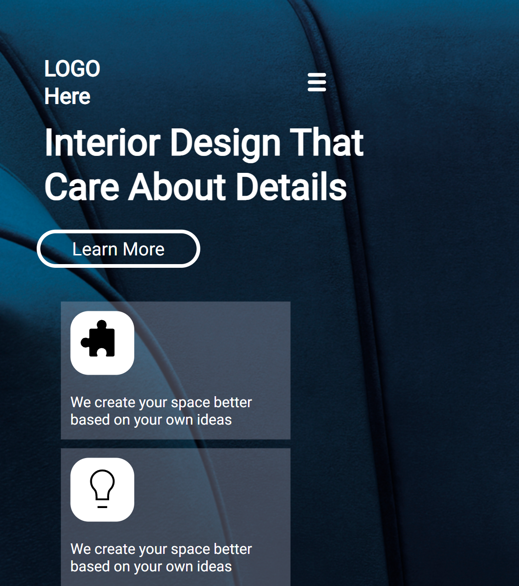

# Hi 👋 I am Devang 
 

## Project Name : **Interior Design Landing Page !**

This project helped in learning how to play around with background images and ajust them as our need arises. Learnig about media query and  its affect on the width of the page. Understanding the ture power of media query, the  ability to redesign a page according to is width is very helpful. 

 

​

# 💻 Tech Stack Used :

​
  

 
​

## 📝 Features

- Responsive for screen size below 600px

- Hosted on Netlify

 

😌 Honest Time to finish the project

     It took me about 6 hrs

 

##  Final Output

 

​

### You can Check it Live on Below Link :

​

[Live Link !]()